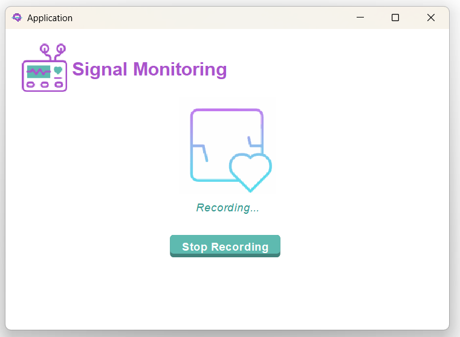

# 🧠 Night Guardian — Patient Application User Guide

The **Night Guardian Patient Application** allows patients to record physiological signals, log symptoms, and securely share information with their assigned doctor.
This guide describes how to use the interface following the expected patient workflow.

---

# How to Download and Run

1. Clone the repository:

```bash
git clone https://github.com/MamenCortes/EpilepsyPatient
```

2. Navigate to the project root folder.
3. Run the executable `.jar` or execute the `Application.java` class.

> Patient Login requires:
> **Email:** provided by the Admin
> **Password:** minimum 8 characters

---

# Initial Conditions

When the Patient Application is launched for the first time:

* The patient must enter the **Server IP address**
* After a successful connection, the **Login Window** appears
* Patient must authenticate using email + password
* The **Main Menu** is displayed after correct login
* BITalino connection is needed to perform recordings

---

# Connecting to the Server

Upon launch, the patient is prompted to enter the **Server IP address**.

### A correct IP → moves to Login

### Incorrect IP → error message appears

 **Server IP Window**


---

# Logging In

Enter:

* **Email**
* **Password**

Possible outcomes:

* Valid → enters Main Menu
* Invalid → shows error message
* No server → returns to IP Screen

 **Login Window**


---

# Main Menu

Once authenticated, the patient sees the main dashboard:

 **Main Menu**


Options:

* **See My Details**
* **My Physician**
* **Recordings History**
* **Symptoms History**
* **New Symptoms**
* **New Recording**
* **Log Out**

---

# New Symptoms

Selecting **New Symptoms** allows the patient to record daily symptoms.


Choose:

* Date of symptom
* One or more symptoms (multi-select)

Click **Save** to store them.

---

# Symptoms History

A monthly calendar shows all reported symptoms with color codes.


Features:

* Monthly view
* Legend of symptoms
* Scrollable list
* Day-by-day detail

---

# New Recording (ECG + ACC)

This section records physiological signals using the BITalino device.

---

## Step 1 — Preparation


---

## Step 2 — Recording in Progress




Patient can press **Stop Recording** at any time.

---

## Step 3 — Saving the Recording

If the recording uploads correctly:


If not, an error message appears.

---

# Recordings History

Shows all past ECG+ACC recordings.
You can:

* Search by date
* Reset list
* Select a recording → open signal viewer

---

# See My Details

Displays:

* Name & surname
* Email
* Date of birth
* Phone
* Gender


---

# ## My Physician

Shows the doctor assigned to the patient:

* Name
* Specialty
* Email
* Phone
* Department


---

# Log Out

Returns the patient to the Login screen.

---

# Authors

* [@MariaMM04](https://github.com/MariaMM04)
* [@MamenCortes](https://github.com/MamenCortes)
* [@MartaSanchezDelHoyo](https://github.com/MartaSanchezDelHoyo)
* [@paulablancog](https://github.com/paulablancog)
* [@Claaublanco4](https://github.com/Claaublanco4)

---

