# 🧠 Night Guardian — Patient Application User Guide

The **Night Guardian Patient Application** allows patients to record physiological signals, log symptoms, and securely share information with their assigned doctor.
This guide describes how to use the interface following the expected patient workflow.

# Table of Contents
- [How to Download and Run](#how-to-download-and-run)
- [Initial Conditions](#initial-conditions)
- [User Interface Guide](#user-interface-guide)
- [Connecting to the Server](#1-connecting-to-the-server)
- [Logging In](#2-logging-in)
- [Main Menu](#3-main-menu)
- [New Recording](#4-new-recording)
- [Handling Network Disruptions](#5-handling-network-disruptions)
- [Authors](#authors)

# How to Download and Run

1. Clone the repository:

```bash
git clone https://github.com/MamenCortes/EpilepsyPatient
```

2. Navigate to the project root folder.
3. Run the executable `.jar` or execute the `Application.java` class.
 ```bash
  java -jar EpilepsyDoctor.jar
  ```

# Initial Conditions
Upon executing the system for the first time, the following users will be automatically added to facilitate the system's navigation: 

| Email  | Password   | Role     |
|-----------|------------|----------|
| @nightguardian.com     | 12345678   | Doctor    |
| @nightguardian.com     | 12345678   | Doctor    |
| @nightguardian.com     | 12345678   | Doctor    |

*The password 12345678 was used by default. However, it can be changed from the LogIn view*

# User Interface Guide
## 1. Connecting to the Server
Upon launch, the patient is prompted to enter the **Server IP address**.

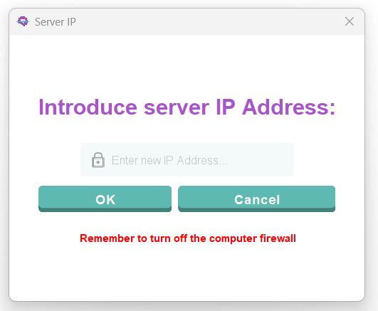

### Requirements for a Successful Connection

* Ensure your computer is on the **same local network** as the server.
* If connection fails repeatedly, adjust or temporarily disable the **firewall** (as permitted by your organization).
* To find the computer’s IP:

  * **Windows:** Open *Command Prompt* → `ipconfig`
  * **Mac/Linux:** Open *Terminal* → `ifconfig`
  * Note that the IP required is not the one of your computer, but the computer's IP where the server is hosted. 

Once the IP is introduced, you can click:

* **OK**
  * If the IP is correct, the login screen will appear.
  * If incorrect, an error message is shown.
* **Cancel**
  * The application closes immediately.

A successful server connection is required before proceeding to authentication.

## 2. Logging In

After connecting, you will be taken to the **Login Screen**.

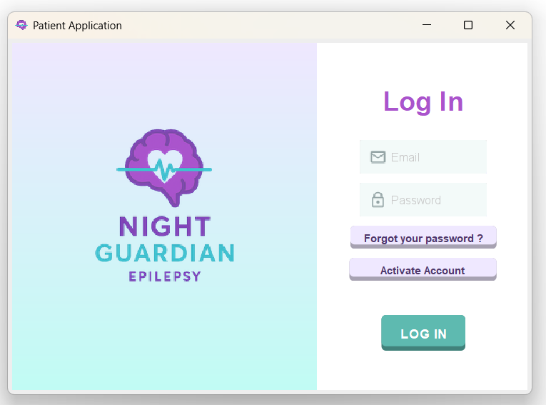

### **Account Access**

When you are granted access to the Night Guardian platform for the first time, the hospital’s **IT department** will provide you with:

* A **corporate email address** (ending in `@nightguardian.com`)
* A **temporary password**
* A **single-use token** to activate your account

You cannot create or register your own account.
### First-Time Access & Account Activation

When a patient accesses the Night Guardian platform for the first time, their account must be activated to ensure secure and authenticated access. Follow the next steps: 

1. **Click “Activate Account”** on the login screen.
  This opens the activation panel required for first-time setup.

2. **Enter your corporate email, temporary password, and single-use activation token.**
  These credentials are provided by the hospital IT department and verify your identity.
  
  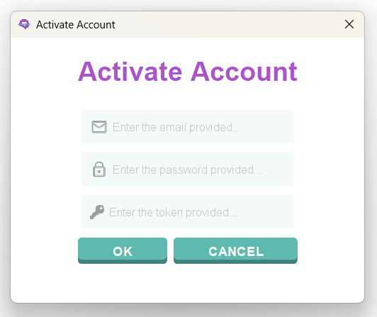
  
  3. **Upon successful validation, the system automatically generates your cryptographic keys:**

      * A **private key**, stored safely on your device
      * A **public key**, sent to the server and saved in the database
        This establishes an encrypted communication channel unique to your account.

4. **Choose a new password** to replace the temporary one.
  The system will only accept passwords that meet the security requirements: minimum 8 characters and at least one special character

5. **Log in normally** with your corporate email and new password and start exploring the App.

### Change password
To change the password, introduce a valid email and then click **"Forgot you password?"**. Then introduce the new password and click **Save**. 


### Login
Once you activate your account, the next times you enter the App, you can LogIn normally from your computer. Just enter:

* Your corporate **Night Guardian email** (`@nightguardian.com`)
* Your **password** (minimum 8 characters + at least one special character/number)

Then click **Log In**. The possible outcomes are: 

* **Successful login** → access to the Doctor Main Menu
* **Incorrect credentials / insufficient permissions** → error message. Retry entering a valid email and password.
  
## 3. Main Menu

Once authenticated, the patient sees the main dashboard:

 **Main Menu**

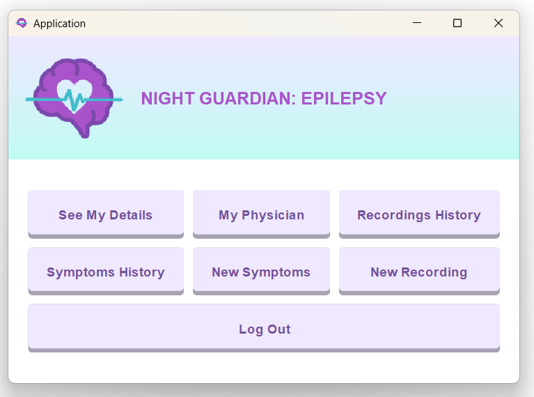

Options:

* **See My Details**: Displays your profile details for review. You cannot change the information. If you need to change any details, please contact the **IT department**.

  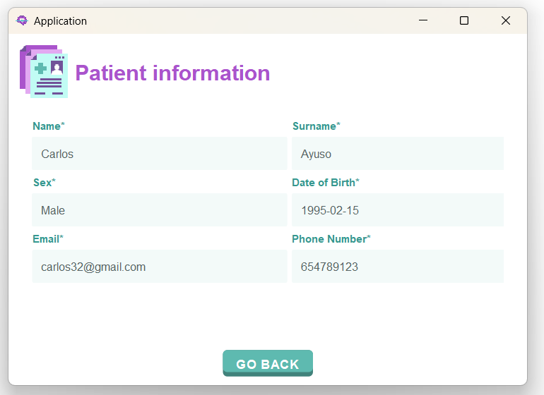
* **My Physician**: Displays your assigned doctor details (name, email, department, speciality, contact details, etc.).

  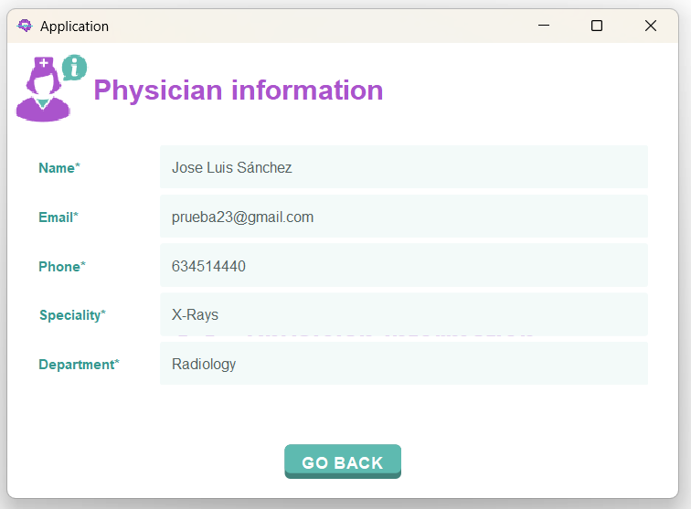
* **Recordings History**: Shows all past ECG+ACC recordings. You can search them by date, reset the filtered list to show all the recordings again and see your doctor's comments on the recordings. You cannot visualize the signal.

  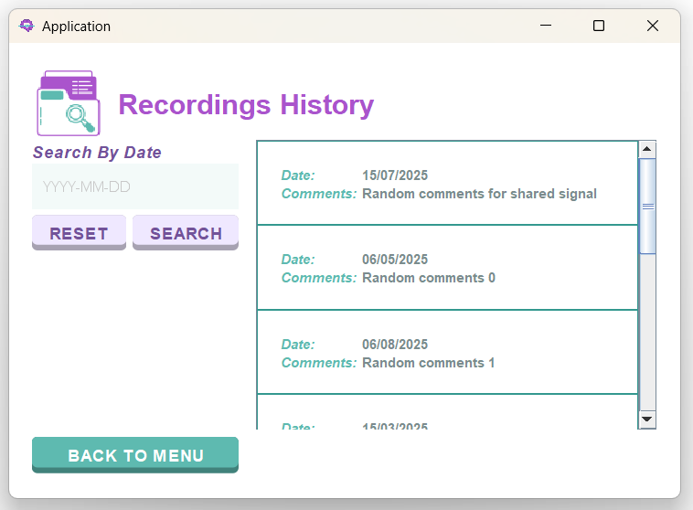
* **Symptoms History**: Displays a monthly calendar showing all reported symptoms with color codes. The main features are:
  * Monthly view
  * Legend of symptoms
  * Scrollable list
  * Day-by-day detail

  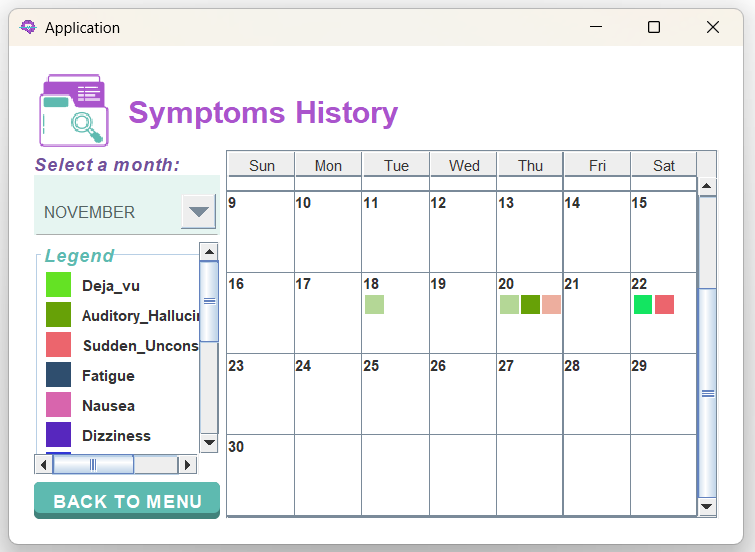
* **New Symptoms**: Selecting **New Symptoms** allows you to record daily symptoms like dizziness, anxiety, nausea, etc. Choose:
  * The date of the symptom: it is set to _today_ by default.
  * One or more symptoms (multi-select)
  * Click **Save** to store them.
 
  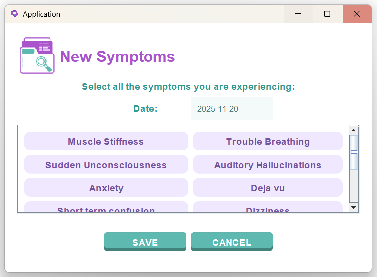
* **New Recording**: This section allows you to connect to a BITalino board, record, and save ECG and ACC signals. 
* **Log Out**: Returns you to the Login screen.


## 4. New Recording

The steps you will have to follow to correctly record and save the signals are the following:

1. **Connect the BITalino Device**: Pair your BITalino board with your computer via **Bluetooth** before starting the recording process.
2. **Enter the MAC Address**
    * If the MAC address is incorrect or the device is not properly connected, an error message will appear.
    * Once the MAC address is valid and the connection is established, you may proceed.
     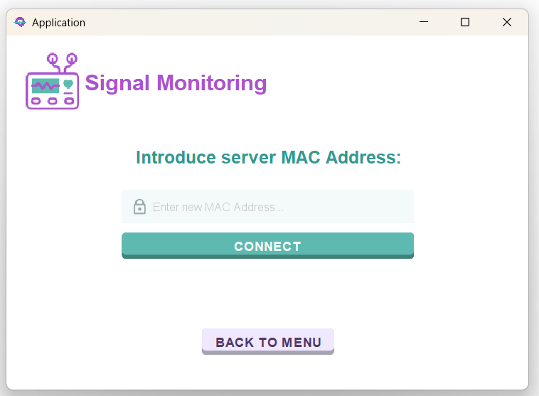
3. **Prepare the Recording Setup**: Attach the electrode cables to the BITalino board and place the electrodes on your body. Your **physician will guide you** on the correct electrode placement for accurate signal acquisition.
4. **Start Recording**: When everything is ready, click **Start recording** to begin capturing the ECG and ACC signals.

   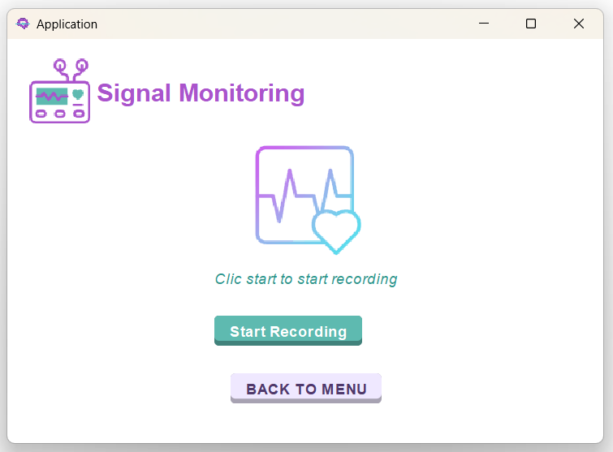
5. **Monitor the recording**: While the system records, an on-screen animation will indicate that the acquisition is in progress. 

   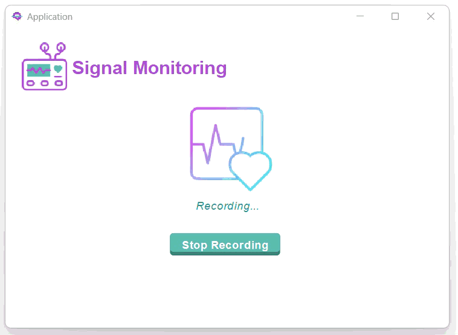

6. **Stop the recording**: You may stop the recording at any time by clicking Stop recording. A confirmation dialog will appear: 
   * **Si**: stops the recording and begins sending the data to the server. The recording will continue until you click **Si**. 
   * **No** / **cancelar**: closes the dialog and continues recording.
     
   
7. **Saving the recording**: After stopping, the signal is processed and saved. During this step, a loading animation will be displayed.

   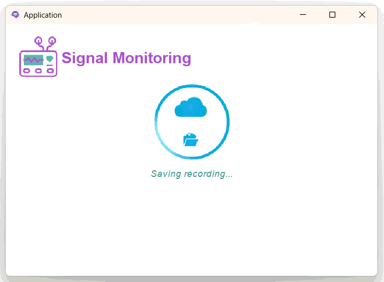

8. **Successful Upload**: If the recording was saved and uploaded correctly, you will see a confirmation message.

   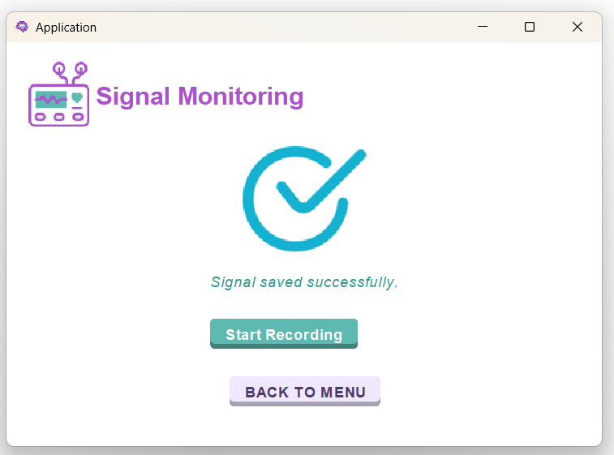
9. **Error While Saving**: If something went wrong during the saving or uploading process, an error message will appear asking if you want to retry the process.
     * **Sí**: retries saving and uploading the signal
     * **No**: displays an error message
   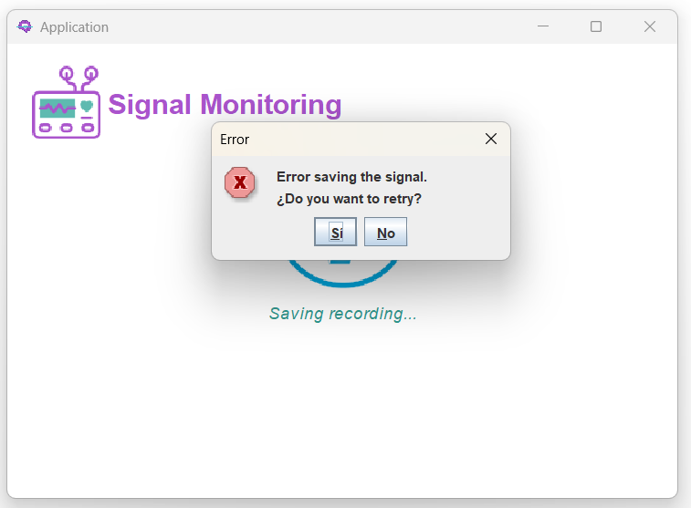
   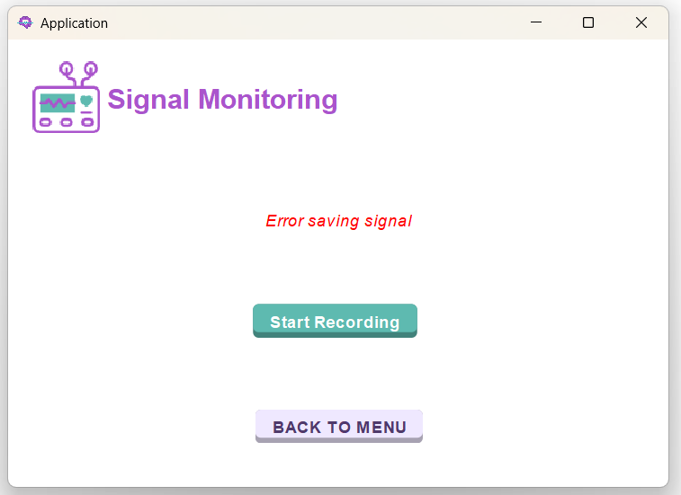

## 5. Handling Network Disruptions

If the server disconnects due to network issues, server shutdown or unexpected errors, the application will: 

1. Display an error message
2. Return to the **Server IP prompt**
3. Require reconnection before further use

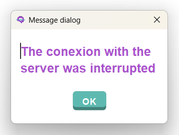

# Authors

* [@MariaMM04](https://github.com/MariaMM04)
* [@MamenCortes](https://github.com/MamenCortes)
* [@MartaSanchezDelHoyo](https://github.com/MartaSanchezDelHoyo)
* [@paulablancog](https://github.com/paulablancog)
* [@Claaublanco4](https://github.com/Claaublanco4)

